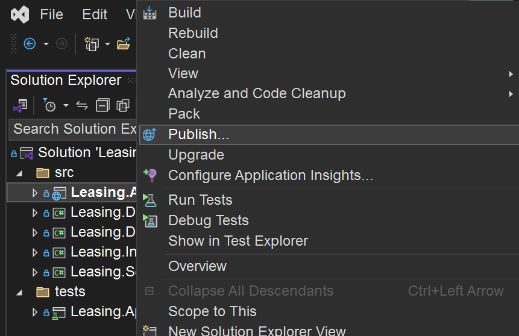
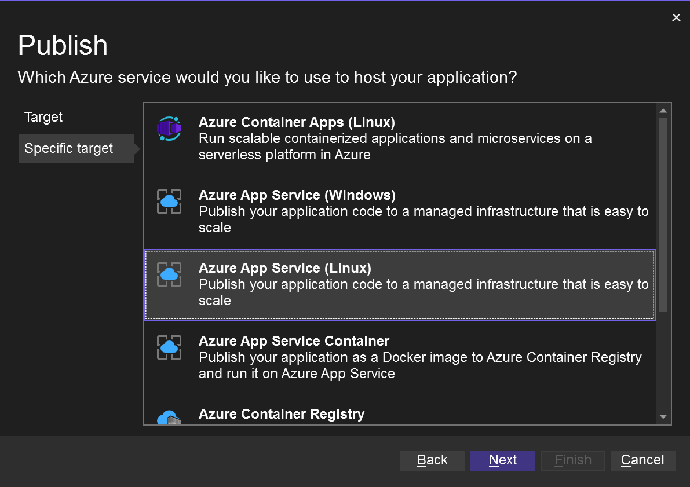
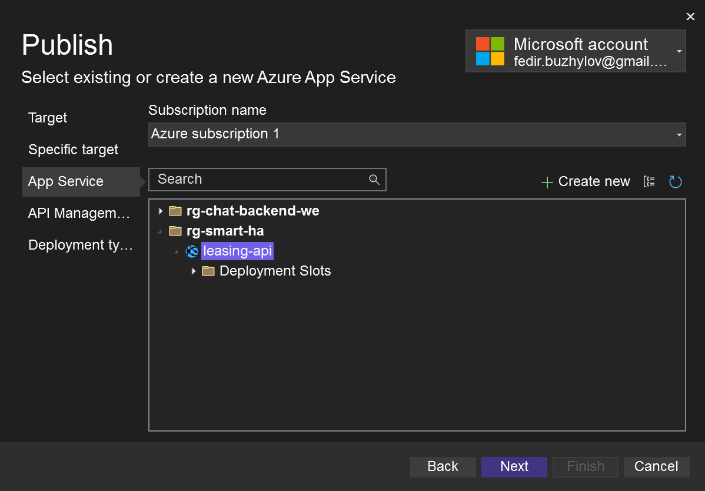
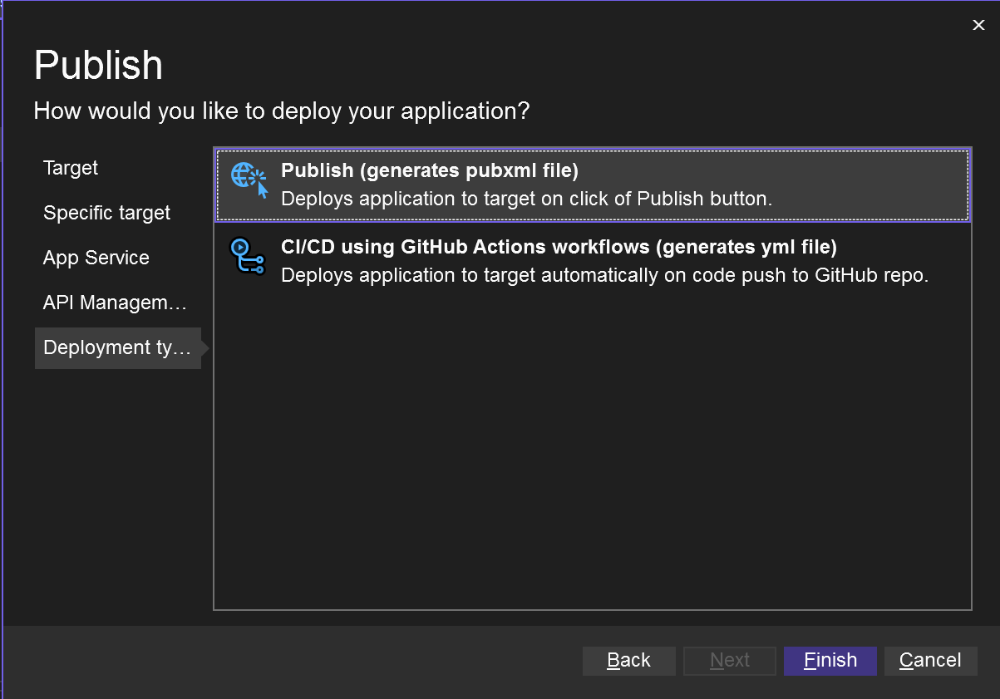
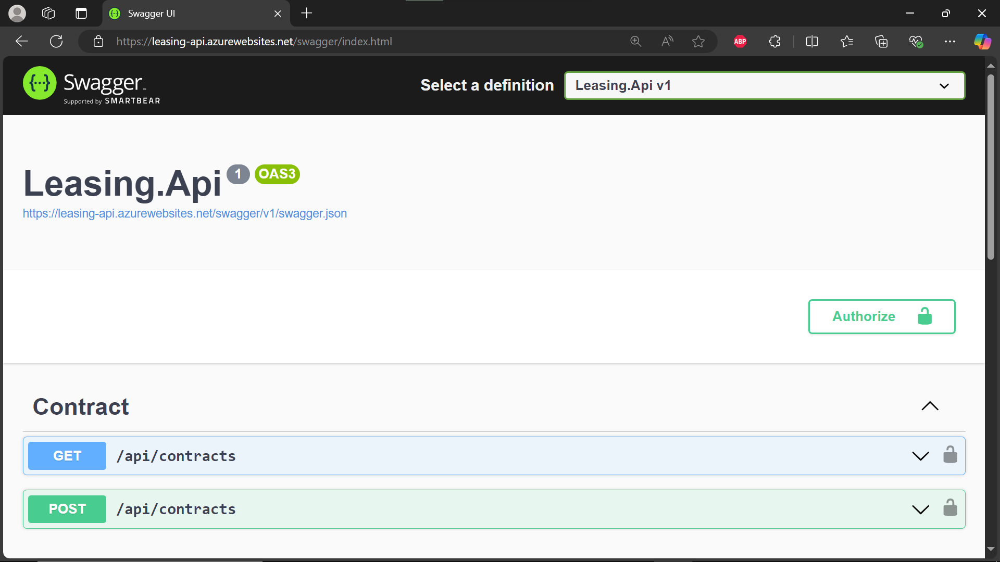

# Facility-Leasing-Backend

### Tech Stack:
- .NET 8, Asp.Net Core WebApi
-  Entity Framework Core
- MS SqlServer, Azure SQL
- Azure App Service

## Running the sample locally

### Configuring the sample to use SQL Server

1. Ensure your connection strings in `appsettings.json` point to a local SQL Server instance.
1. Ensure the tool EF was already installed. You can find some help [here](https://docs.microsoft.com/ef/core/miscellaneous/cli/dotnet)

    ```
    dotnet tool update --global dotnet-ef
    ```

1. Open a command prompt in the Leasing.Data folder and execute the following commands:

    ```    dotnet restore
    dotnet ef database update --startup-project ..\Leasing.Api\ 
    ```

    These commands will create local MS SQL database.

    Note: If you need to create migrations, you can use these commands:

    ```    -- create migration (from Leasing.Data folder CLI)
    dotnet ef migrations add InitialModel --startup-project ..\Leasing.Api\
    ```

## Deploying to Azure App Service from Visual Studio

### 1. Open the Leasing.Backend solution in Visual Studio.

### 2. Right-click on the Web project in Solution Explorer and choose Publish.



## 3. Choose Microsoft Azure App Service.


### 4. Choose Azure App Service Linux 



### 5. Choose an App Name, Subscription, Resource Group, and App Service Plan.



### 6. Choose Deployment type and click publish.



### 7. Leasing.Backend deployed to Azure.


